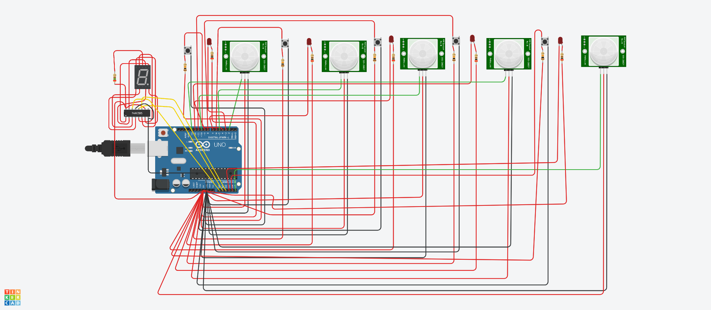

# ASK_Projekt2

## Opis projektu
System wykorzystuje mikrokontroler ATMega328P (Arduino), czujniki PIR oraz panel LED do monitorowania ruchu i sygnalizowania alarmu. Pozwala na kontrolę statusu czujników, wyświetlanie informacji o stanie alarmu i rejestrację liczby wykrytych zdarzeń.

## Funkcjonalności
•	Jednostka sterująca – ATMega328P (Arduino)
•	Obsługa 5 czujników PIR
•	Możliwość włączenia/wyłączenia każdego czujnika
•	Każdy czujnik z diodą LED sygnalizującą o działaniu czujnika (świeci się – działa; 
nie świeci się – nie działa)
•	Panel LED wyświetla informację czy alarm jest aktywny (dolna kreska – nieaktywny; górna kreska – aktywny)
•	Licznik wykrytych ruchów od momentu uruchomienia symulacji

## Użyty sprzęt
• ATMega328P (Arduino)
• Czujnik PIR x5
• Przycisk x5
• Rezystor x11
• 8-bitowy rejestr przesuwny 74HC595
• Dioda LED dla każdego czujnika
• Panel LED (7-segmentowy wyświetlacz LED)
• Przewody połączeniowe

## Schemat

## Link do obwodu w TinkerCad
[Projekt alarmu](
https://www.tinkercad.com/things/3uRDqUS0d7I-askprojekt2?sharecode=PXTgYRAD4aL4zZJHm-AW6LG9UpWjbe82dBJNhwuUyPY)

## Opis działania alarmu

### Stan początkowy
• Po uruchomieniu systemu alarmowego alarm pozostaje nieaktywny.
• Na panelu LED wyświetlana jest dolna kreska (_), co oznacza, że system znajduje się w trybie czuwania.

### Aktywacja alarmu
• Alarm zostaje aktywowany po naciśnięciu przycisku pierwszego czujnika.
• Dioda LED przy czujniku zaczyna świecić, sygnalizując jego aktywność.
• Na panelu LED pojawia się górna kreska (-), oznaczająca włączony alarm.
• System pozostaje aktywny, dopóki przynajmniej jeden czujnik jest włączony.

### Wykrywanie ruchu
• Gdy którykolwiek z czujników PIR wykryje ruch, panel LED przestaje wyświetlać górną kreskę (-).
• Zamiast tego pojawia się liczba aktywnych czujników, które wykryły ruch (wartość od 1 do 5).

### Dezaktywacja czujników
• Gdy czujnik przestanie wykrywać ruch, liczba na panelu LED zostaje odpowiednio zmniejszona.
• Proces ten trwa, aż wszystkie czujniki zostaną wyłączone.

### Wyłączenie alarmu
• Po dezaktywacji wszystkich czujników panel LED ponownie wyświetla dolną kreskę (_), sygnalizując powrót systemu do trybu czuwania.
• szystkie czujniki są nieaktywne, a alarm pozostaje wyłączony do momentu ponownej aktywacji któregokolwiek z czujników.

## Opis kodu

### Tablice pinów
pirPins[], buttonPins[], ledPins[] – przechowują numery pinów odpowiadających czujnikom PIR, przyciskom oraz diodom LED.

### Inicjalizacja
W funkcji setup() definiowane są tryby pracy pinów: jako wejścia (czujniki, przyciski) lub wyjścia (diody, rejestr przesuwny).
Aktywowany zostaje port szeregowy do monitorowania zdarzeń.

### Obsługa przycisków
W pętli loop() stan przycisków jest odczytywany za pomocą digitalRead().
Naciśnięcie przycisku zmienia status czujnika (aktywny/nieaktywny).

### Wykrywanie ruchu
Czujniki PIR monitorują obecność ruchu.
Po wykryciu ruchu odpowiednia zmienna pirDetected[] zostaje ustawiona na true.

### Wyświetlanie na panelu LED
Funkcja writeLED(byte data) przesyła dane do rejestru przesuwnego (74HC595), który steruje 7-segmentowym wyświetlaczem LED.
Wartości w tablicy liczby[] odpowiadają cyfrom od 1 do 5.

## Autor
Michał Kurpiewski 21253

## Licencja
Licencja MIT
